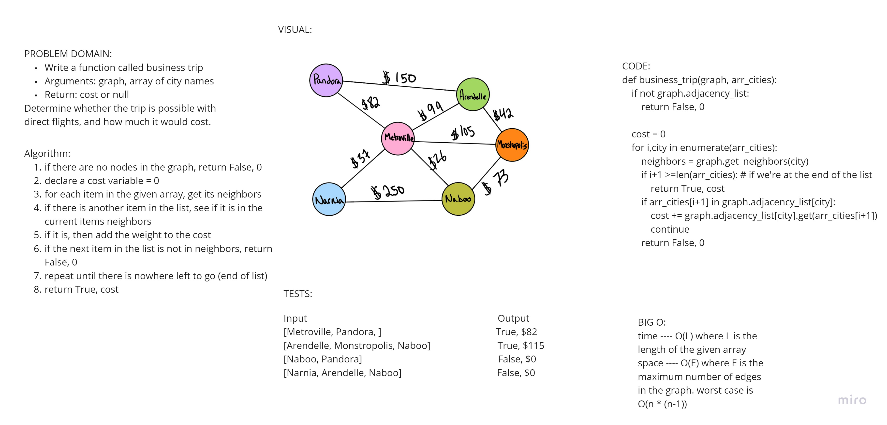

# Challenge Summary
-Write a function called business trip
-Arguments: graph, array of city names
-Return: cost or null
-Determine whether the trip is possible with direct flights, and how much it would cost.

## Whiteboard Process

## Approach & Efficiency
this approach is O(L*N) time, where L is the length of the input array and N is the maximum number of neighbors for all nodes in the given array
space complexity is O(N) where N is the maximum number of neighbors for all nodes in the given array. this could be reduced to O(1) if an iterator were used
