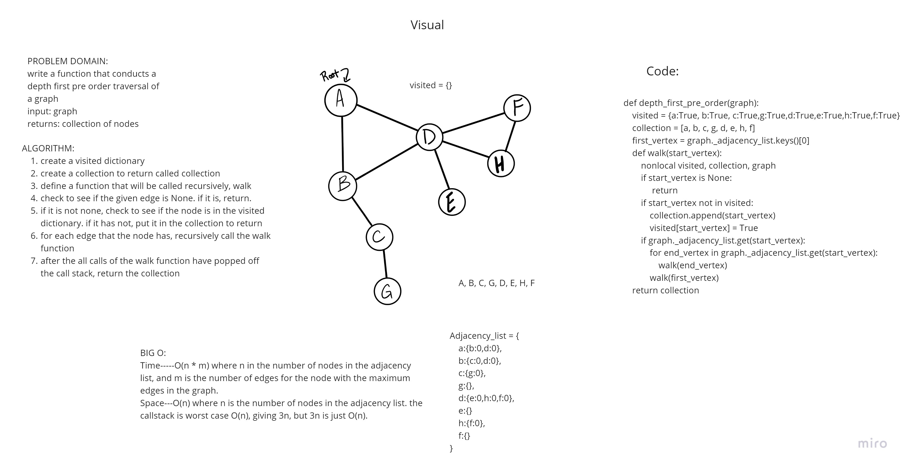

# Challenge Summary
write a function that performs a depth first pre order traversal of a graph from a given vertex

## Whiteboard Process

## Approach & Efficiency
Time --- O(n) each vertex in the graph must be visited at last once
Space O(n) visited and collection are O(n) and the callstack is worst case O(n), so the overall is O(n)
