# Insertion Sort
I hope you're ready to learn about insertion sort because here we go!

insertion sort works by looping through a list of numbers, comparing the number you want to sort to the previous numbers, and then placing it in its appropriate place. Don't worry, it isnt as hard as it sounds and i have some amazing visuals to help with your learning journey today. 

So lets start with this array:
  [8,4,23,42,16,15]

so we would start our for loop at the second position in the array, which in index 1. So, i = 1, and we assign j to be whatever is just to the left of i, which will be i-1. so, j = i-1. we then enter a while loop and compare the value at i to the value at j, and if its smaller, and j is greater than 0, we move the value at j over to the right one spot. this continues until we find a number that is smaller than the value at i. once we find that value, then we assign the value at i to be the value at position j+1, which is just to the right of that smaller number we just found. dont worry, ill provide some rad viuals to help out with this. 

so heres what it looks like when we first enter the first iteration of the for loop:
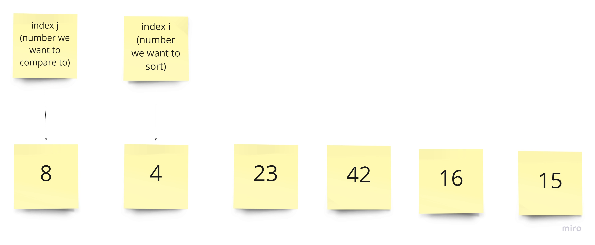

we see that 4 is less than 8, so 8 gets slid over to the right one space
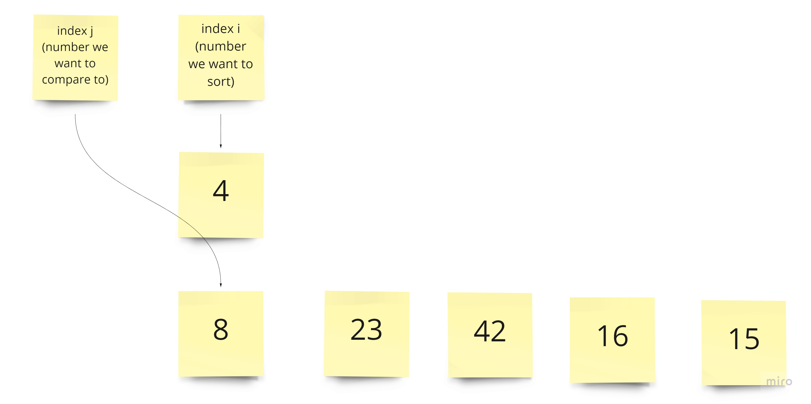

we see that there are no more numbers to the left, so the number at i then gets put in the empty space
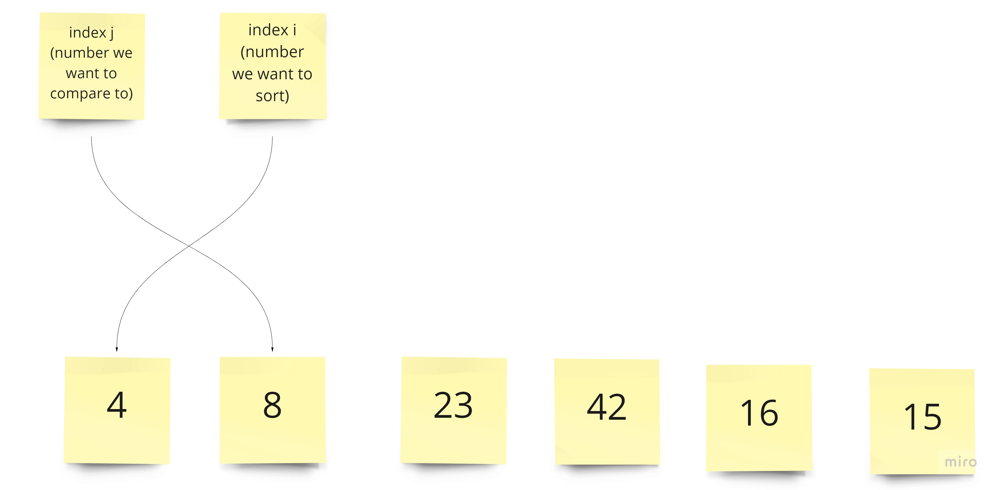

we then go back up to the for loop, and move i and j like this:
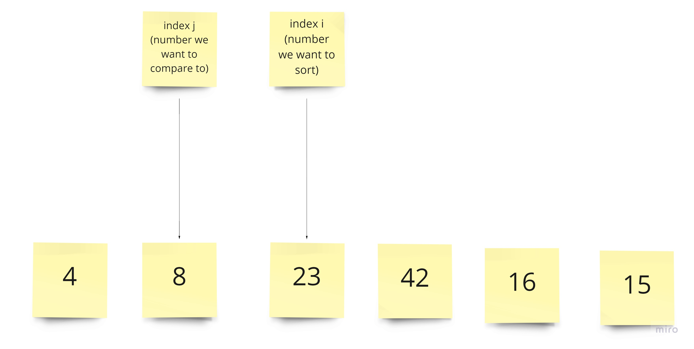

we see that 23 is not smaller than 8, 23 and 8 stay in the same place theyre at, and we move i and j like this:
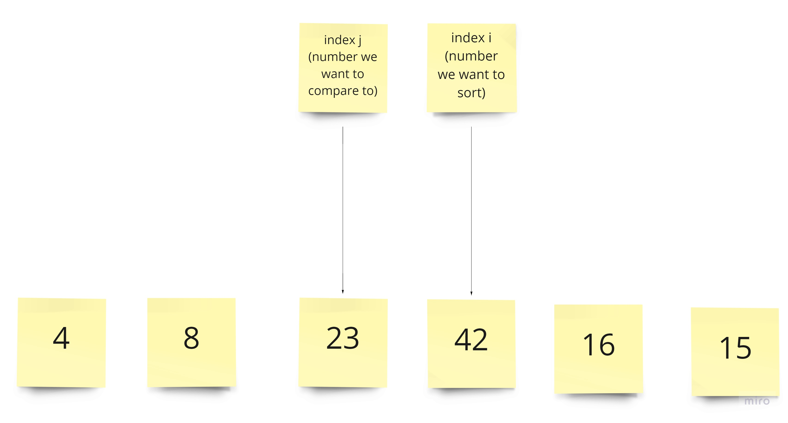

42 is not smaller than 23, so they stay in the same place. i and j get moved again like this:
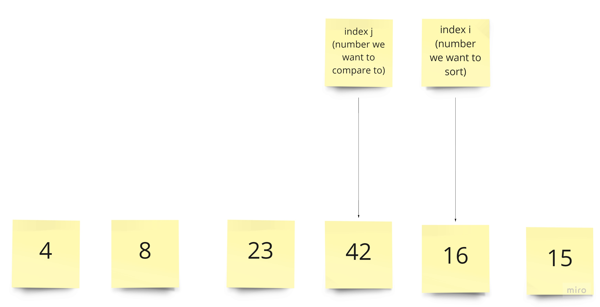

we see that 16 is less than 42, so we move 42 to the right one space like so:
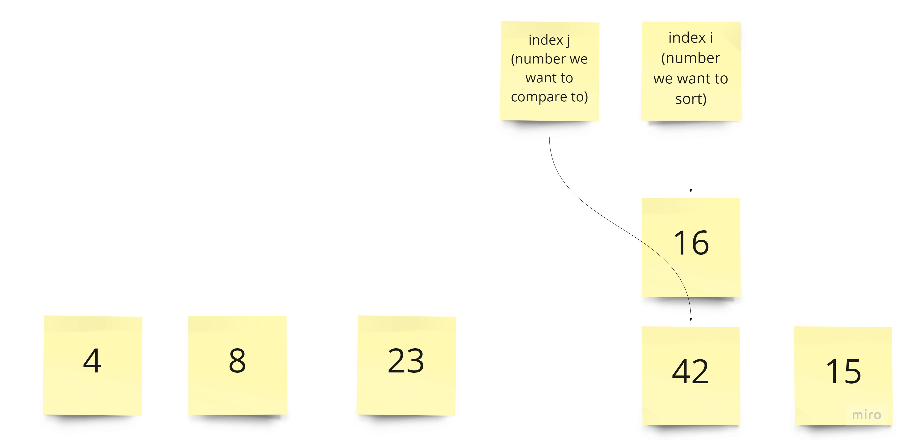

j gets reassigned to j-1 like so:
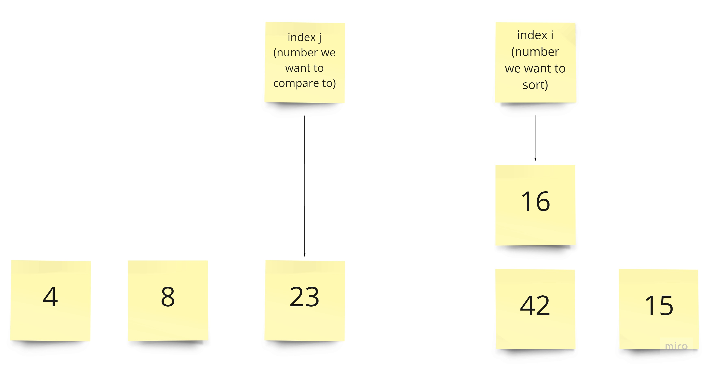

16 is less than 23, so 16 moves to the right one space and j gets reassigned to j-1 like this:
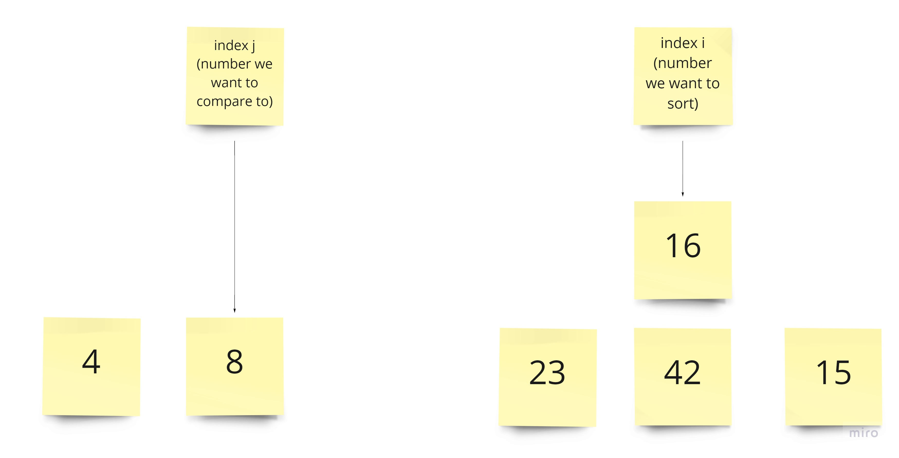

16 is greater than 8, so 16 gets put to the spot to the right of 8, and i and j get moved like this:
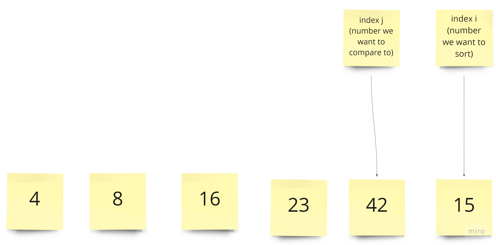

15 is less than 42, and so we compare and move indexes until we find a number smaller than 15. when we do, we put 15 to the right of it like this:
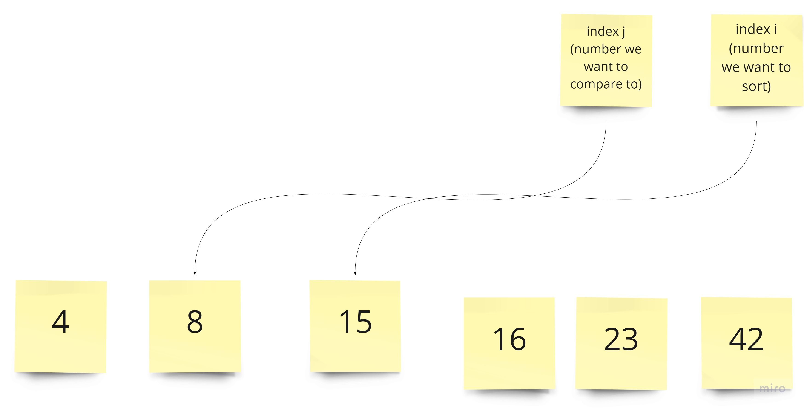

the array is now sorted! here is the python code for the insertion sort algorithm:
  ```
  def insertion_sort(arr):
  for index, value in enumerate(arr):
    j = index-1
    while j >= 0 and value < arr[j]:
      arr[j+1] = arr[j]
      j-=1
    arr[j+1] = value


