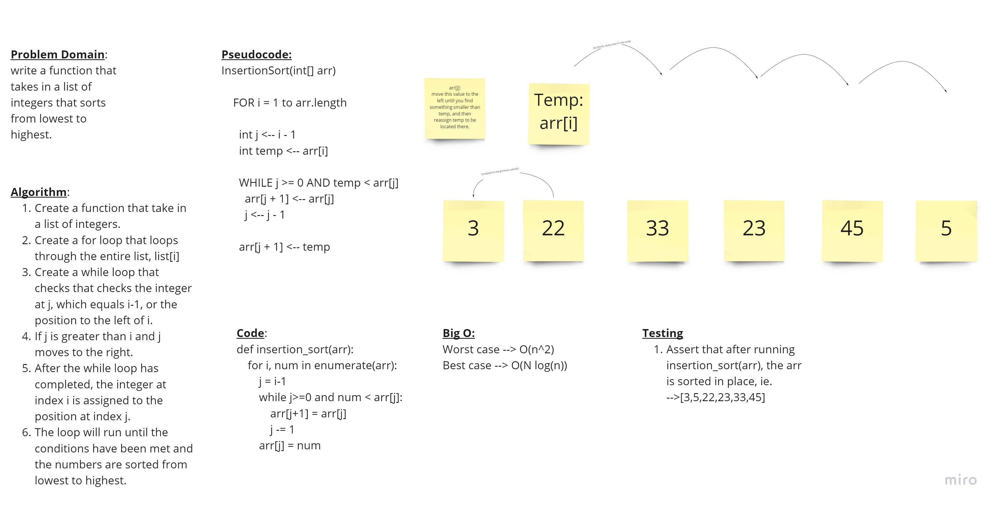

# Challenge Summary
Define a function called insertion sort that takes in array and sorts it in place.

## Whiteboard Process
checkout the 

## Approach & Efficiency
I decided to use a for loop with a while loop inside. the for loop runs the length of the array and the while loop runs as long as j is greater than or equal to zero, and the number being sorted is smaller than the number we're looking at in the while loop. this algorithm is O(n^2) worst case, and O(N log(n)) best case. the space complexity is O(1).

