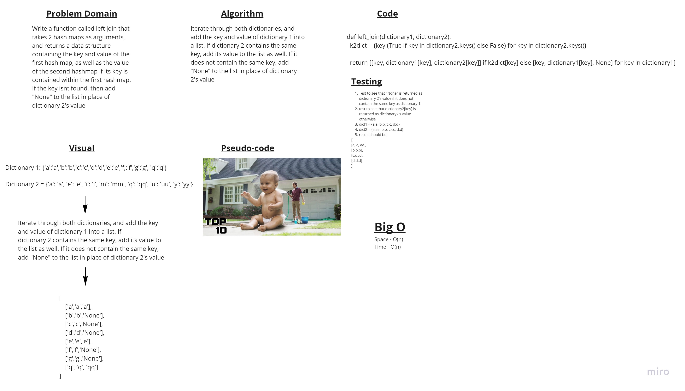

# Challenge Summary
Write a function that takes in two dictionaries and outputs the intersection of those dictionaries

## Whiteboard Process

## Approach & Efficiency
This solution is O(n) for both time and space because you have to loop through at least one of the dictionaries keys, and store some result that takes up the same amount of space as there are keys.

