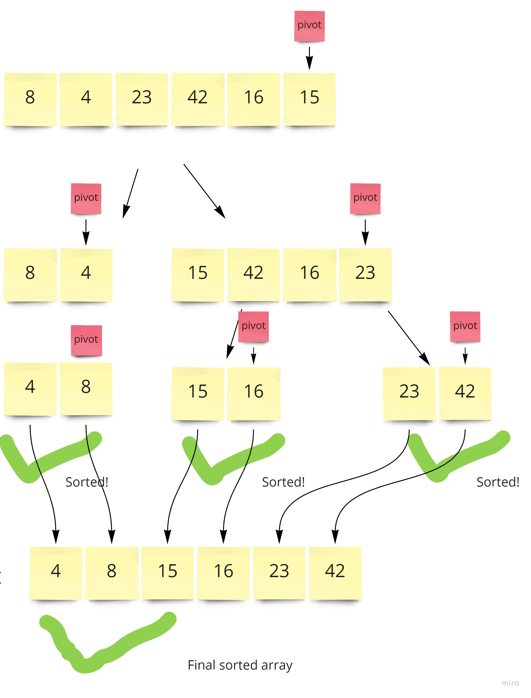

# Super Cool Blog Post About Quicksort Right Here
So this time on the super cool DSA blog post, we're talking about quicksort. Quicksort is used under the hood for alot of programming languages as the default sorting method. It uses a combonation of recursion and iteration to sort lists super fast. The basic idea is you pick a pivot element in the array, and the pivot says "everyone less than me go to the left , pick a pivot, and get yourselves sorted. everyone greater than me come with me and we'll pick a new pivot and get ourselves sorted". This message gets passed recursively until everyone is sorted (i.e, the number of elements to the left of the pivot is less than the number on the right, always making the pivot the very last element in each group). when each recursive call resolves, the array is modified in place and you end up with a sorted array. Here is a visual to help this make more sense.
