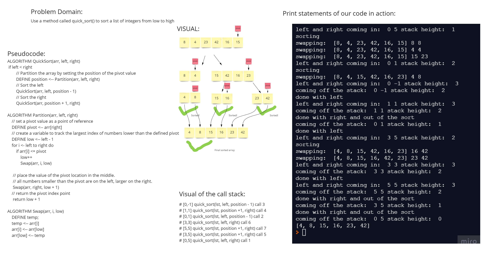

# Challenge Summary
Turn the given pseudocode for quicksort into working code.

## Whiteboard Process

## Approach & Efficiency
We got the pseudocode coded out into working code, and then added print statements to understand exactly what was going on. The position and pivot variables are basically taking the place of making a slice of the array and then telling the recursive calls where to start and where the pivot is.
The time complexity is O(n * log(n)) on average, O(n^2) worst case, and the space complexity is O(log(n))

