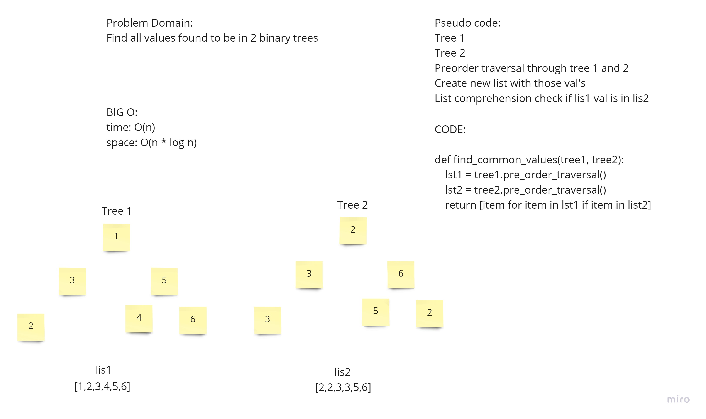

# Challenge Summary
find which values are common in two binary trees

## Whiteboard Process

## Approach & Efficiency
I just traversed each tree, and compared each item in one tree to see if it was in the other tree. 
time: O(n) because we need to visit each node in the tree
space: O(n) because we need to store each item in each a tree in a list, and logn for the call stack but we drop that because log n is less than O(n)

